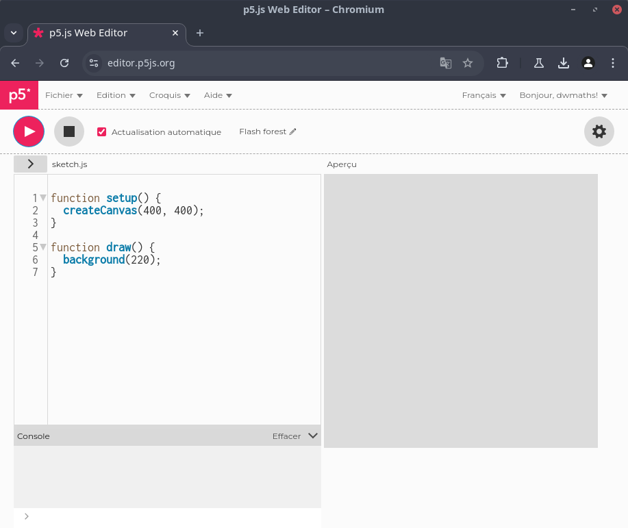
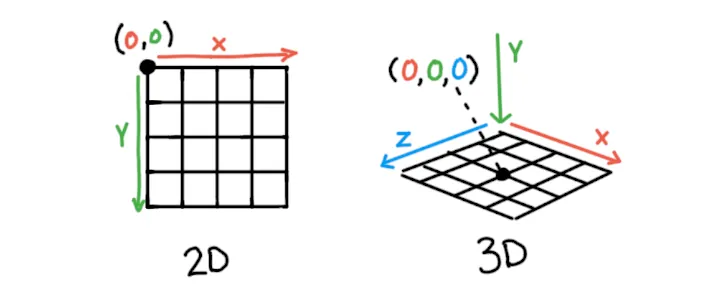
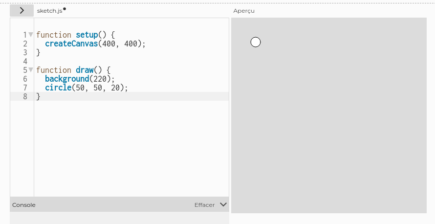
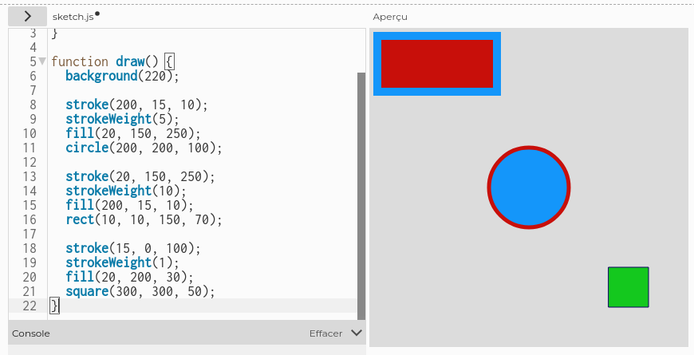
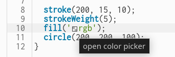
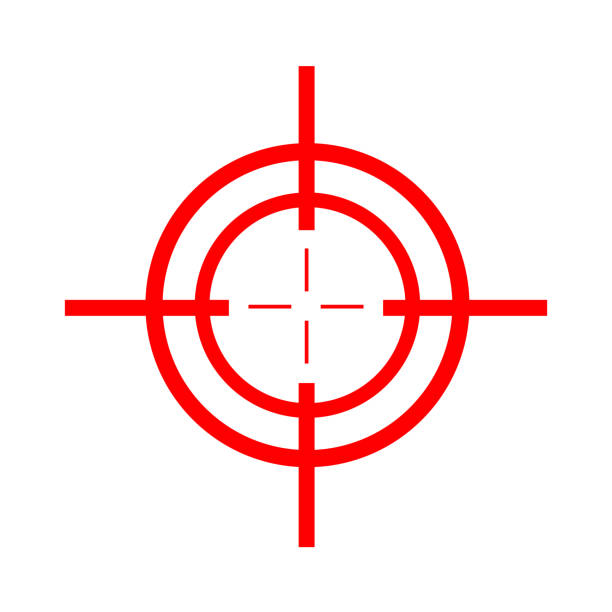
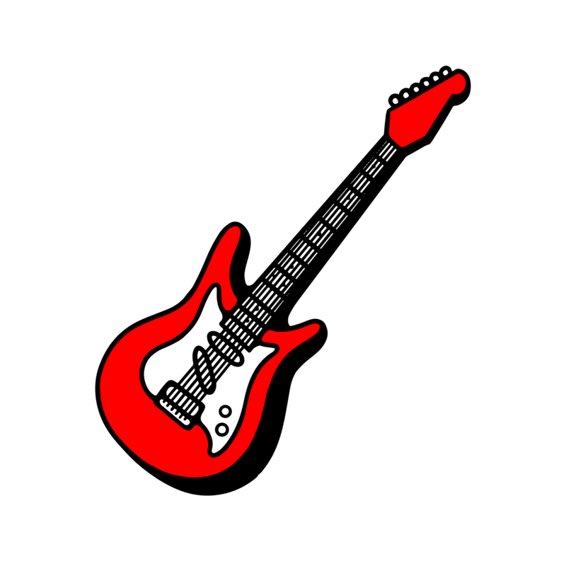
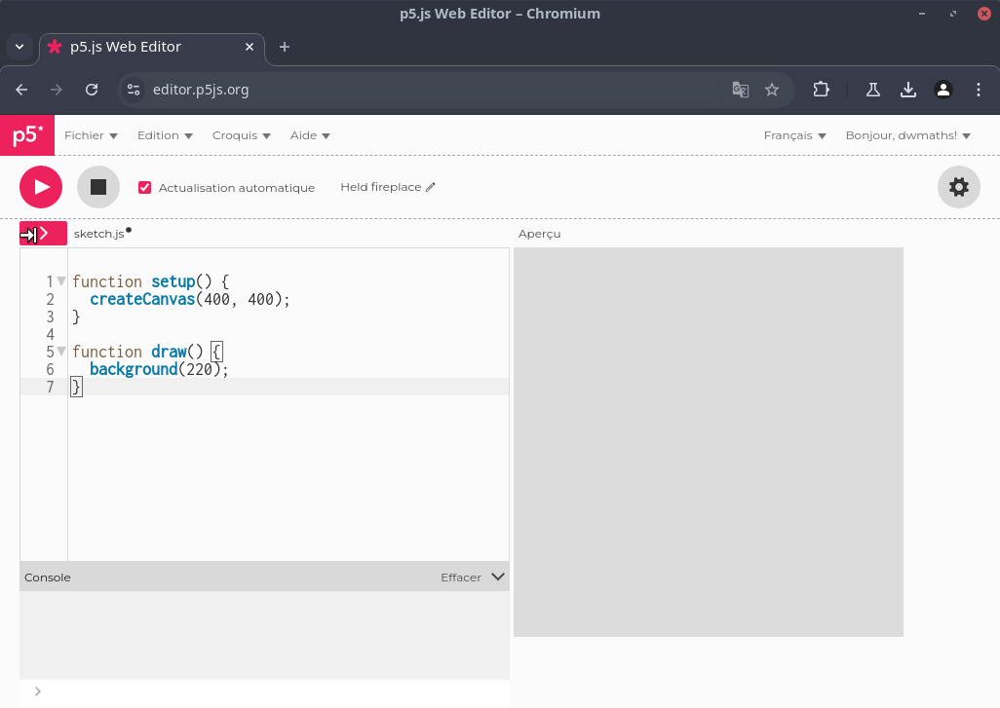
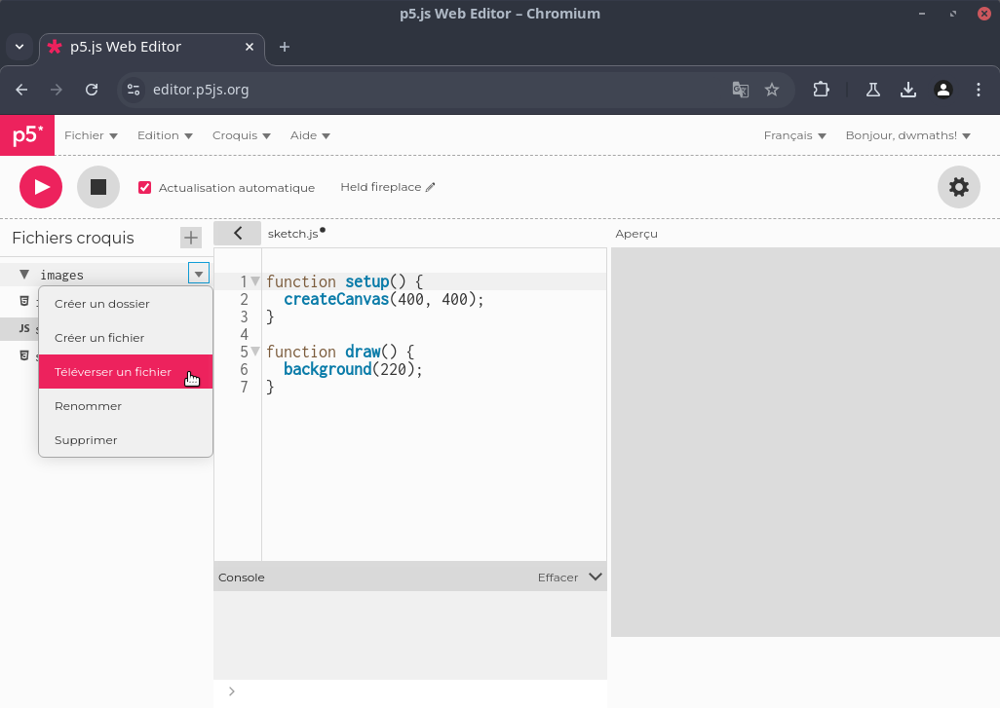

# Le langage P5JS

## Introduction

### Préparatifs

P5JS est une bibliothèque Javascript reprenant les concepts fondamentaux du langage Processing.

<center>
    
</center>

Il permet la réalisation de **sketch** interactifs qui s'intègrent facilement dans un environnement WEB.  
Pour cela, une solution est de se rendre sur l'éditeur WEB en cliquant [ici](https://editor.p5js.org/) puis de créer un nouveau compte.  

Vous obtenez alors l'interface :

<center>
    
</center>

Dans **P5JS** (comme dans Processing) il existe des fonctions prédéfinies avec chacune un rôle spécifique. Ici, on voit :

- la fonction **setup** : qui gère l'initialisation du sketch ;
- la fonction **draw**  : qui gère le dessin du sketch.

On crée une **zone de dessin** (canvas) et on y met **un fond gris** (background) que l'on dessine à chaque fois que cela est nécessaire.

### Dessiner

Pour dessiner sur le **canvas**, P5JS utilise un système de coordonnées classique où l'origine se trouve dans le coin supérieur gauche.

<center>
    
</center>

Par exemple, pour dessiner un cercle de centre $(50, 50)$ et de rayon $20$, on écrit dans la fonction **draw** :

``` javascript title="Dessiner un cercle"

function draw() {
  background(220);
  circle(50, 50, 20);
}
```

ce qui donne le canvas ci-dessous :

<center>
    
</center>

Il est évidemment possible de customiser les dessins à l'aide de fonctions présentées dans le tableau ci-dessous :

| **Fonction** | **Argument(s)** | **Rôle**                                          | **Exemple**                              |
|:------------:|:---------------:|:-------------------------------------------------:|:----------------------------------------:|
| stroke       | une couleur     | Change la couleur du contour de la forme dessinée | stroke(255, 255, 0) ou stroke('orange')  |
| strokeWeight | un nombre       | Change la taille du contour de la forme           | strokeWeight(10)                         |
| fill         | une couleur     | Rempli la forme d'une couleur donnée              | fill(128, 10, 54)                        |

Par exemple, le code :

``` javascript title="Customiser son dessin"

function setup() {
  createCanvas(400, 400);
}

function draw() {
  background(220);
  
  stroke(200, 15, 10);
  strokeWeight(5);
  fill(20, 150, 250);
  circle(200, 200, 100);
  
  stroke(20, 150, 250);
  strokeWeight(10);
  fill(200, 15, 10);
  rect(10, 10, 150, 70);
  
  stroke(15, 0, 100);
  strokeWeight(1);
  fill(20, 200, 30);
  square(300, 300, 50);
}
```

produit le dessin suivant :

<center>
    
</center>

!!! tip "Astuce pour les couleurs"

    Il est possible d'écrire une couleur au format **RGB** en tapant `'rgb'` (entre quote), une petite palette est alors proposée pour
    choisir la couleur directement.

    <center>
        
    </center>

!!! question "Exercice"

    1. Représenter la cible ci-dessous :

    <center>
        
    </center>

    On pourra utiliser la fonction **translate** pour déplacer l'origine du repère et ainsi simplifier les coordonnées.  
    On utilisera aussi la fonction **line** pour tracer une ligne et **strokeCap** pour gérer leur forme.

### Interactivité

P5JS gère automatiquement certains évènements liés à la position de la souris et à la gestion du clavier.  
Par exemple, tout au long du programme, les variables **mouseX** et **mouseY** correspondent à la position de la souris.  
Ainsi, le code suivant :

``` javascript title="Suivre le curseur"

function setup() {
  createCanvas(400, 400);
}

function draw() {
  background(220);
  
  stroke(0);
  strokeWeight(5);
  fill(255);
  circle(mouseX, mouseY, 100);
}
```

produit le résultat suivant :

<center>
    <video controls src="/videos/mouse.mp4" poster="/images/apercu.png" width=800 height=auto></video>
</center>

Pour le clavier, on peut utiliser la fonction **keyPressed** comme dans l'exemple :

``` javascript title="Avec le clavier"

let x, y;

function setup() {
  createCanvas(400, 400);
  x = 200;
  y = 200;
}

function draw() {
  background(220);
  
  stroke(0);
  strokeWeight(5);
  fill('#CF1B1B');
  square(x, y, 50);
}

function keyPressed() {
  if (keyCode === LEFT_ARROW) {
    x = x - 10;
  }
  if (keyCode === RIGHT_ARROW) {
    x = x + 10;
  }
  if (keyCode === UP_ARROW) {
    y = y - 10;
  }
  if (keyCode === DOWN_ARROW) {
    y = y + 10;
  }
}
```

qui produit le résultat :

<center>
    <video controls src="/videos/clavier.mp4" poster="/images/apercu.png" width=800 height=auto></video>
</center>

!!! note "Déclaration de variables"

    Remarquez que pour déclarer des variables, on utilise le mot clé `let`.  
    On déclare plutôt les variables en global pour pouvoir les utiliser dans plusieurs fonctions.

## Les images

### Chargement et affichage

Avant d'afficher des images, il faut qu'elles soient accessibles.  
Pour cela, il faut les importer dans le projet (vu que l'on travaille avec un éditeur en ligne).  

On souhaite importer l'image :

<center>
    
</center>

que vous pouvez télécharger [ici](/images/guitare.png).

Pour importer cette image, cliquez sur l'extension de la barre latérale grâce au bouton situé sous le symbole **Lecture**.

<center>
    
</center>

Créez un dossier nommé **images** à l'aide du bouton $+$, puis en se plaçant dans ce dossier choisissez **Téléverser** pour importer une image à l'aide d'un **glisser-déposer**. 

<center>
    
</center>

Une fois l'image disponible dans l'espace WEB, il faut l'afficher dans le canvas.  
Pour afficher une image, il faut déjà qu'elle soit chargée. C'est le rôle de la fonction **preload**.  
Il s'agit d'une fonction prédéfinie qui va effectuer le travail avant l'affichage de la page WEB.  

Le code ci-dessous en montre une utilisation simple.

``` javascript title="Chargement et affichage d'une image"

let img;

function preload(){
  img = loadImage('/images/guitare.png');
}

function setup() {
  createCanvas(400, 400);
}

function draw() {
  background(220);
  image(img, 0, 0, 400, 400);
}
```

qui produit le résultat :

<center>
    <video controls src="/videos/load.mp4" poster="/images/apercu.png" width=800 height=auto></video>
</center>

!!! warning

    Remarquez la présence du **Loading...** le temps du chargement de l'image.

!!! important "Affichage d'une image"

    Pour afficher une image, on utilise la fonction **image**.  
    Il est possible de redimensionner l'image passée en argument.

### Flux vidéo
