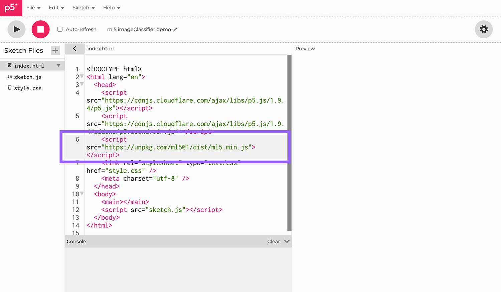

# Javascript et IA

## Introduction au langage P5JS

### Préparatifs

P5JS est une bibliothèque Javascript reprenant les concepts fondamentaux du langage Processing.

<center>
    
</center>

Il permet la réalisation de **sketch** interactifs qui s'intègrent facilement dans un environnement WEB.  
Pour cela, une solution est de se rendre sur l'éditeur WEB en cliquant [ici](https://editor.p5js.org/) puis de créer un nouveau compte.  

Vous obtenez alors l'interface :

<center>
    
</center>

Dans **P5JS** (comme dans Processing) il existe des fonctions prédéfinies avec chacune un rôle spécifique. Ici, on voit :

- la fonction **setup** : qui gère l'initialisation du sketch ;
- la fonction **draw**  : qui gère le dessin du sketch.

On crée une **zone de dessin** (canvas) et on y met **un fond gris** (background) que l'on dessine à chaque fois que cela est nécessaire.

### Dessiner

Pour dessiner sur le **canvas**, P5JS utilise un système de coordonnées classique où l'origine se trouve dans le coin supérieur gauche.

<center>
    
</center>

Par exemple, pour dessiner un cercle de centre $(50, 50)$ et de rayon $20$, on écrit dans la fonction **draw** :

``` javascript title="Dessiner un cercle"

function draw() {
  background(220);
  circle(50, 50, 20);
}
```

ce qui donne le canvas ci-dessous :

<center>
    
</center>

Il est évidemment possible de customiser les dessins à l'aide de fonctions présentées dans le tableau ci-dessous :

| **Fonction** | **Argument(s)** | **Rôle**                                          | **Exemple**                              |
|:------------:|:---------------:|:-------------------------------------------------:|:----------------------------------------:|
| stroke       | une couleur     | Change la couleur du contour de la forme dessinée | stroke(255, 255, 0) ou stroke('orange')  |
| strokeWeight | un nombre       | Change la taille du contour de la forme           | strokeWeight(10)                         |
| fill         | une couleur     | Rempli la forme d'une couleur donnée              | fill(128, 10, 54)                        |

Par exemple, le code :

``` javascript title="Customiser son dessin"

function setup() {
  createCanvas(400, 400);
}

function draw() {
  background(220);
  
  stroke(200, 15, 10);
  strokeWeight(5);
  fill(20, 150, 250);
  circle(200, 200, 100);
  
  stroke(20, 150, 250);
  strokeWeight(10);
  fill(200, 15, 10);
  rect(10, 10, 150, 70);
  
  stroke(15, 0, 100);
  strokeWeight(1);
  fill(20, 200, 30);
  square(300, 300, 50);
}
```

produit le dessin suivant :

<center>
    
</center>

!!! tip "Astuce pour les couleurs"

    Il est possible d'écrire une couleur au format **RGB** en tapant `'rgb'` (entre quote), une petite palette est alors proposée pour
    choisir la couleur directement.

    <center>
        
    </center>

!!! question "Exercice"

    1. Représenter la cible ci-dessous :

    <center>
        
    </center>

    On pourra utiliser la fonction **translate** pour déplacer l'origine du repère et ainsi simplifier les coordonnées.  
    On utilisera aussi la fonction **line** pour tracer une ligne et **strokeCap** pour gérer leur forme.

### Interactivité

P5JS gère automatiquement certains évènements liés à la position de la souris et à la gestion du clavier.  
Par exemple, tout au long du programme, les variables **mouseX** et **mouseY** correspondent à la position de la souris.  
Ainsi, le code suivant :

``` javascript title="Suivre le curseur"

function setup() {
  createCanvas(400, 400);
}

function draw() {
  background(220);
  
  stroke(0);
  strokeWeight(5);
  fill(255);
  circle(mouseX, mouseY, 100);
}
```

produit le résultat suivant :

<center>
    <video controls src="./videos/mouse.mp4" poster="/images/apercu.png" width=800 height=auto></video>
</center>

Pour le clavier, on peut utiliser la fonction **keyPressed** comme dans l'exemple :

``` javascript title="Avec le clavier"

let x, y;

function setup() {
  createCanvas(400, 400);
  x = 200;
  y = 200;
}

function draw() {
  background(220);
  
  stroke(0);
  strokeWeight(5);
  fill('#CF1B1B');
  square(x, y, 50);
}

function keyPressed() {
  if (keyCode === LEFT_ARROW) {
    x = x - 10;
  }
  if (keyCode === RIGHT_ARROW) {
    x = x + 10;
  }
  if (keyCode === UP_ARROW) {
    y = y - 10;
  }
  if (keyCode === DOWN_ARROW) {
    y = y + 10;
  }
}
```

qui produit le résultat :

<center>
    <video controls src="./videos/clavier.mp4" poster="/images/apercu.png" width=800 height=auto></video>
</center>

!!! note "Déclaration de variables"

    Remarquez que pour déclarer des variables, on utilise le mot clé `let`.  
    On déclare plutôt les variables en global pour pouvoir les utiliser dans plusieurs fonctions.

## Images et P5JS

### Chargement et affichage

Avant d'afficher des images, il faut qu'elles soient accessibles.  
Pour cela, il faut les importer dans le projet (vu que l'on travaille avec un éditeur en ligne).  

On souhaite importer l'image :

<center>
    
</center>

que vous pouvez télécharger [ici](./images/guitare.png).

Pour importer cette image, cliquez sur l'extension de la barre latérale grâce au bouton situé sous le symbole **Lecture**.

<center>
    
</center>

Créez un dossier nommé **images** à l'aide du bouton $+$, puis en se plaçant dans ce dossier choisissez **Téléverser** pour importer une image à l'aide d'un **glisser-déposer**. 

<center>
    
</center>

Une fois l'image disponible dans l'espace WEB, il faut l'afficher dans le canvas.  
Pour afficher une image, il faut déjà qu'elle soit chargée. C'est le rôle de la fonction **preload**.  
Il s'agit d'une fonction prédéfinie qui va effectuer le travail avant l'affichage de la page WEB.  

Le code ci-dessous en montre une utilisation simple.

``` javascript title="Chargement et affichage d'une image"

let img;

function preload(){
  img = loadImage('./images/guitare.png');
}

function setup() {
  createCanvas(400, 400);
}

function draw() {
  background(220);
  image(img, 0, 0, 400, 400);
}
```

qui produit le résultat :

<center>
    <video controls src="./videos/load.mp4" poster="./images/apercu.png" width=800 height=auto></video>
</center>

!!! warning

    Remarquez la présence du **Loading...** le temps du chargement de l'image.

!!! important "Affichage d'une image"

    Pour afficher une image, on utilise la fonction **image**.  
    Il est possible de redimensionner l'image passée en argument.

### Flux vidéo

Il est également possible de récupérer le flux d'une Webcam et de l'afficher dans le Canvas avec les fonctions suivantes :

- **createCapture** : à laquelle on fournit l'argument **VIDEO** ;
- **image** : pour afficher l'image associée à la capture vidéo.

!!! warning "Attention"

    Il est important de cacher la vidéo capturée sous peine d'avoir deux version de l'image superposées.

Le code suivant permet d'afficher le flux associé à la Webcam :

``` javascript title="Affichage de la webcam"

let video;

function setup() {
  createCanvas(640, 480);
  video = createCapture(VIDEO);
  video.hide();
}

function draw() {
  background(220);
  image(video, 0, 0);
}
```

qui produit le résultat :

<center>
    <video controls src="./videos/webcam.mp4" poster="./images/apercu.png" width=800 height=auto></video>
</center>

## Intelligence artificielle

### La bibliothèque ML5

ML5.js vise à rendre l'apprentissage automatique (machine learning) accessible à un large public d'artistes, de codeurs créatifs et d'étudiants. La bibliothèque donne accès aux algorithmes et modèles d'apprentissage automatique dans le navigateur, en s'appuyant sur TensorFlow.js sans aucune autre dépendance externe.

Pour pouvoir utiliser cette bibliothèque, il faut la relier à notre **sketch** en modifiant la page **index.html**.

Commencez par ouvrir l'arborescence de gauche :

<center>
    
</center>

ouvrez le fichier **index.html** et ajoutez la ligne :

``` html title="Lier la bibliothèque"

<script src="https://unpkg.com/ml5@1/dist/ml5.min.js"></script>

```

<center>
    
</center>

Une fois liée, il est possible d'utiliser cette bibliothèque pour reconnaître des images.

### Reconnaissance d'image

La reconnaissance d'image consiste à associer un nom à une image de façon à ce que ce nom soit cohérent avec ce que représente l'image.
Il y a donc l'idée de probabilité derrière la reconnaissance d'image et la performance d'un modèle se mesure donc sur sa capacité à ne pas commettre d'erreur.  

La bibliothèque ML5 propose plusieurs modèles dont **MobileNet** basée sur une collection d'images labélisées appelée **ImageNet**.  
On peut retrouver une partie de cette collection à l'adresse [MobileNet Sample](https://github.com/EliSchwartz/imagenet-sample-images/blob/master/gallery.md).

#### MobileNet

Pour charger le modèle **MobileNet** on utilise une variable `classifier` que l'on affecte à ce modèle depuis la fonction **preload** :

``` javascript title="Chargement de MobileNet"

let classifier;

function preload() {
  classifier = ml5.imageClassifier("MobileNet");
}
```

on charge ensuite une image et on l'affiche dans le canvas :

``` javascript title="Chargement d'une image"

let classifier;
let img;

function preload() {
  classifier = ml5.imageClassifier("MobileNet");
  img = loadImage('./images/guitare.png');
}

% ...

function draw() {
  background(220);
  image(img, 0, 0, 400, 400);
}
```

et enfin on évalue cette image avec la méthode **classify** :

``` javascript title="Classification"

let classifier;
let img;

function preload() {
  classifier = ml5.imageClassifier("MobileNet");
  img = loadImage('./images/guitare.png');
}

function gotResults(results) {
  console.log(results);
}

function setup() {
  createCanvas(400, 400);
  classifier.classify(img, gotResults);
}

function draw() {
  background(220);
  image(img, 0, 0, 400, 400);
}
```

On obtient à la fin :

<center>
    <video controls src="./videos/classify.mp4" poster="./images/apercu.png" width=800 height=auto></video>
</center>

!!! important

    La fonction **classify** prend deux arguments :

      - l'image à classifier ;
      - une fonction de traitement à exécutée après la classification.

    Cette fonction de traitement possède un argument qui est un tableau des différentes propositions de classification.

On peut améliorer la présentation avec un affichage personnalisé via le code : 

``` javascript title="Customisation de l'affichage"

function gotResults(results) {
  label = results[0].label;
}

% ...

function draw() {
  background(220);
  image(img, 0, 0, 400, 400);

  fill(0);
  rectMode(CENTER);
  rect(width/2, height-50, width, 50);

  fill(255);
  textSize(32);
  textAlign(CENTER, CENTER);
  text(label, width/2, height-50);
}

```

<center>
    <video controls src="./videos/classify2.mp4" poster="./images/apercu.png" width=800 height=auto></video>
</center>

on voit alors que le modèle ne fournit pas toujours une réponse exacte.  

Il est possible de classifier une image provenant d'une webcam en adaptant le code précédent pour un flux vidéo.  
On utilise alors la fonction **classifyStart** plutôt que **classify** pour que la classification se réalise de manière continue.

``` javascript title="Classification d'un flux vidéo"

let classifier;
let video;
let label = "En attente...";

function preload() {
  classifier = ml5.imageClassifier("MobileNet");
}

function gotResults(results) {
  label = results[0].label;
}

function setup() {
  createCanvas(640, 480);
  video = createCapture(VIDEO);
  video.hide();
  classifier.classifyStart(video, gotResults);
}

function draw() {
  background(220);
  image(video, 0, 0, 640, 480);
  fill(0);
  rectMode(CENTER);
  rect(width/2, height-50, width, 50);
  fill(255);
  textSize(32);
  textAlign(CENTER, CENTER);
  noStroke();
  text(label, width/2, height-50);
}
```

<center>
    <video controls src="./videos/classify3.mp4" poster="./images/apercu.png" width=800 height=auto></video>
</center>

#### Teachable machine

On vient de voir que les modèles prédéfinis ne sont pas aussi performant qu'espéré.  
Aussi pour certains projets plus spécifiques, il peut être utile de définir son propre modèle pour accroître l'efficacité de la classification.  

Cela est possible grâce à l'outil en ligne **teachablemachine** que vous retrouverez en cliquant [ici](https://teachablemachine.withgoogle.com/).  
Cet outil permet de créer son propre modèle en associant à une collection d'images un label précis. On parle alors de données labélisées.

Voici un exemple concret de son utilisation :

<center>
    <video controls src="./videos/teachable.mp4" poster="./images/apercu.png" width=800 height=auto></video>
</center>